# Security Hardening and Traffic Analysis

## Harden the OpenWRT System

OpenWRT was secured by modifying the default root password, audit on password storage, enable SSH key authentication and disable an unnecessary service. The password of the root account has been set with `passwd` to minimise the risk of unauthorised access with known or weak passwords.

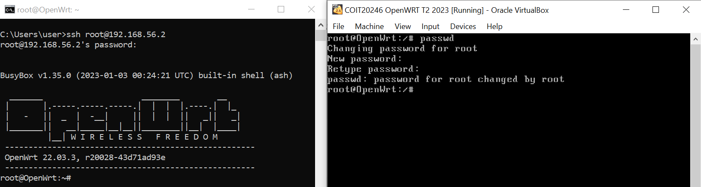
*Figure 22: Root password changed using the `passwd` command on OpenWRT.*

The `/etc/shadow` file was checked with `grep root /etc/shadow`. The password is stored as a hash, not plaintext, meaning the original password is not directly visible if the file is accessed.

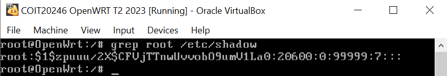
*Figure 23: Hashed root password entry stored securely in the `/etc/shadow` file.*

An Ed25519 SSH key pair was generated on Windows and the public key was added to `/etc/dropbear/authorized_keys`. Key-based login was then tested successfully from Windows. This is stronger than password-only login because authentication depends on possession of the private key.

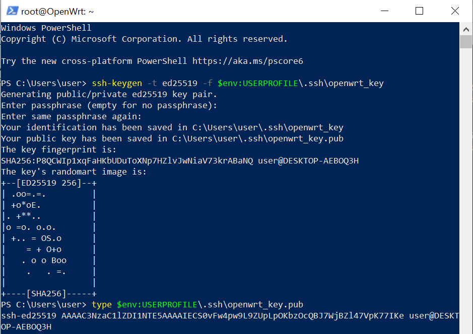
*Figure 24: Ed25519 SSH key pair generated on the Windows host system.*

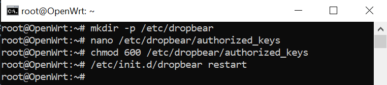
*Figure 25: Public SSH key added to the `authorized_keys` file in OpenWRT.*

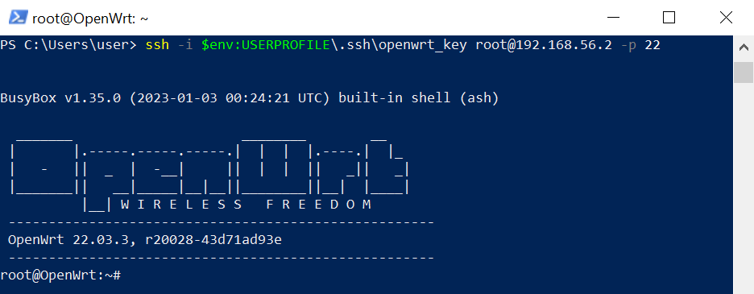
*Figure 26: Successful SSH login using key-based authentication.*

The unnecessary `odhcpd` service was stopped and disabled because IPv6 DHCP/router advertisement was not required for this IPv4 lab setup.

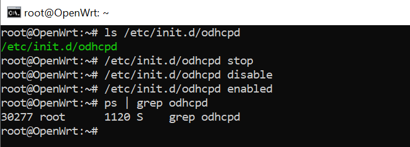
*Figure 27: `odhcpd` service stopped and disabled on OpenWRT.*

## Traffic Analysis

HTTP traffic was captured on OpenWRT using `tcpdump` on `br-mng` and analysed in Wireshark. The capture showed a `GET` request from `192.168.56.1` to `192.168.56.2` and an `HTTP/1.1 200 OK` response. The TCP stream revealed the website content, including the business name and student details, proving that HTTP transmits data in plaintext.

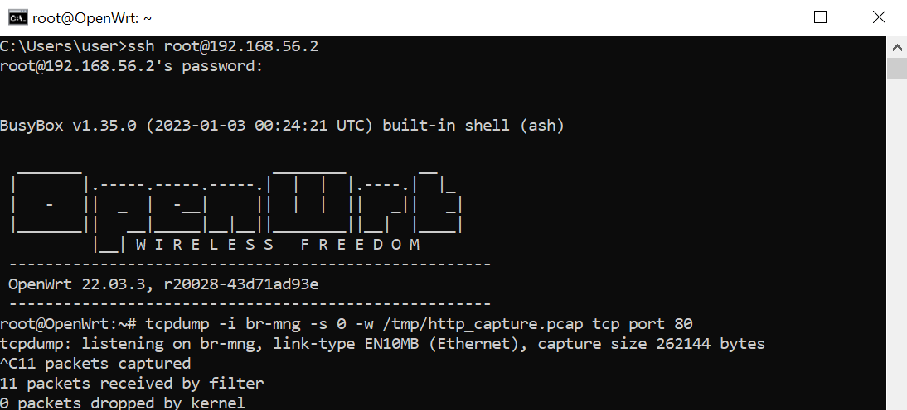
*Figure 28: `tcpdump` command used to capture HTTP traffic on the management bridge interface.*

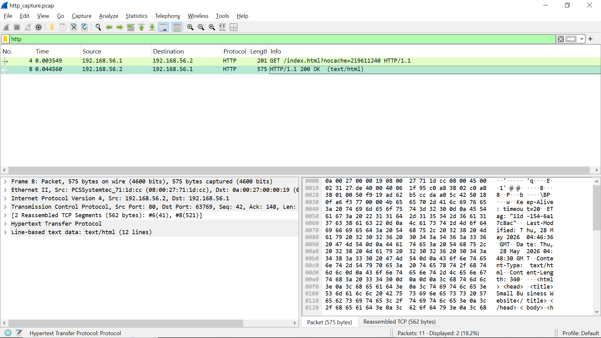
*Figure 29: HTTP packet capture displayed and analysed in Wireshark.*

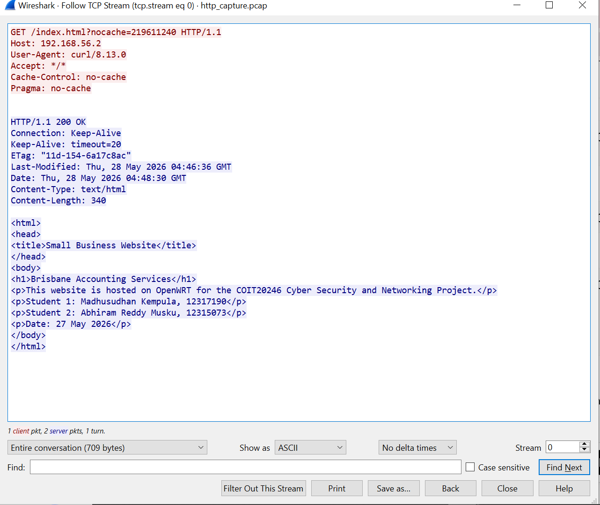
*Figure 30: Wireshark Follow TCP Stream output showing plaintext HTTP website content.*

[Download HTTP capture](./captures/http_capture.pcap)

Also SSH traffic was captured and analysed. Wireshark indicated that there were SSH encrypted packets between the Windows host and the OpenWRT, but with the command contents unreadable. This is a good example of the importance of encrypted protocols in safeguarding data in transit.

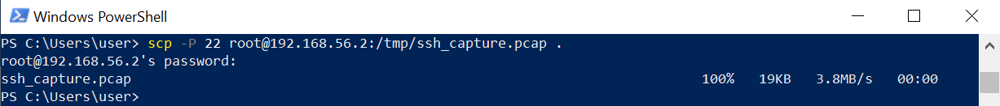
*Figure 31: SSH packet capture file copied from OpenWRT using SCP.*

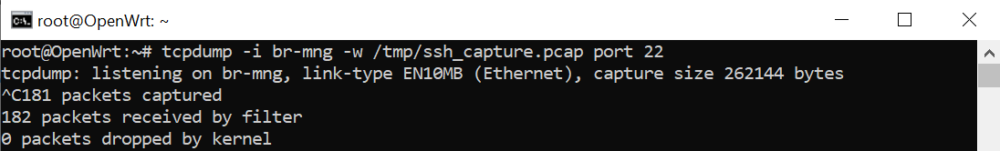
*Figure 32: `tcpdump` command used to capture SSH traffic.*

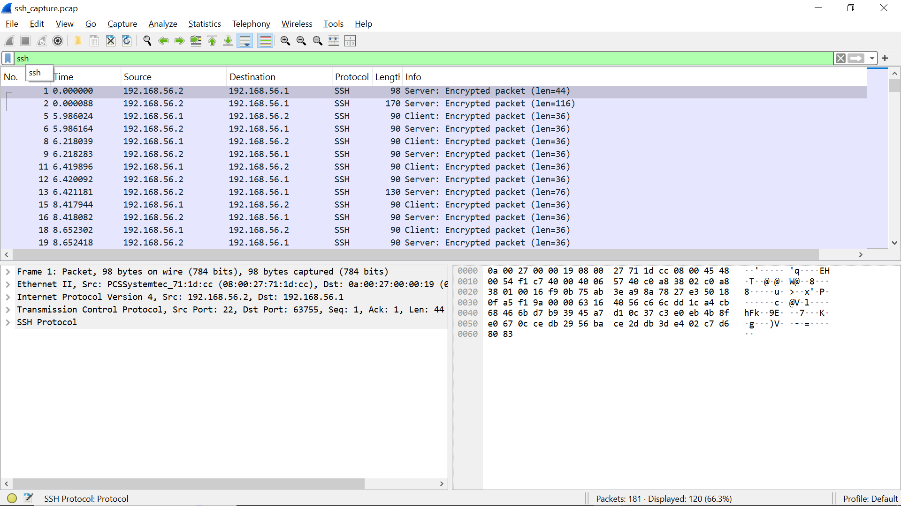
*Figure 33: Encrypted SSH packets analysed in Wireshark demonstrating protected communication.*

[Download SSH capture](./captures/ssh_capture.pcap)
