# Network Setup

## Assumptions

The business is a small accounting services company in Brisbane with 8 employees – 1 Manager, 4 accounting staff, 2 administrative staff and one IT support. The website displays the basic information about the business, details of the project, student names, student ID and current date.

## OpenWRT and VirtualBox Setup

The lab network used an OpenWRT VM in VirtualBox. The Windows host connected through the host-only adapter `192.168.56.1/24`, while OpenWRT used `br-mng` at `192.168.56.2/24`. Interface `eth0` was bridged to `br-mng`, and `eth1` was used as the WAN/NAT interface. Connectivity was confirmed using ping, and the website was hosted from `/srv/www/index.html`.

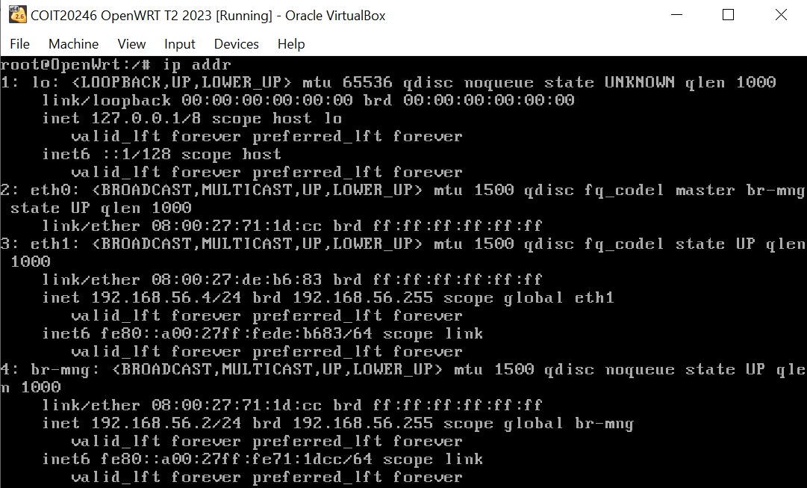
*Figure 1: OpenWRT IP address configuration using the `ip addr` command.*

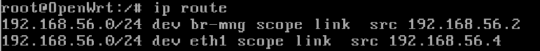
*Figure 2: OpenWRT routing table showing default and local network routes.*

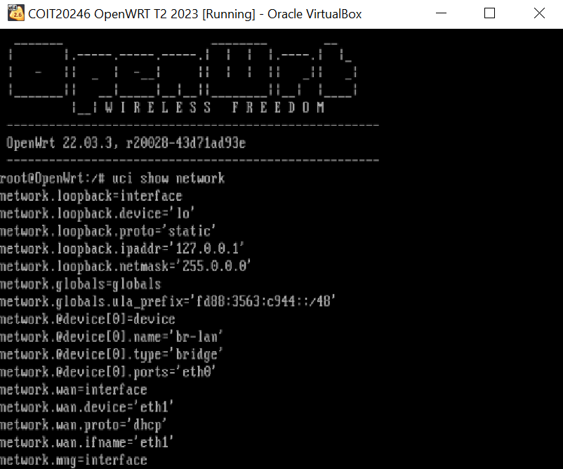
*Figure 3: OpenWRT UCI network configuration for LAN and WAN interfaces.*

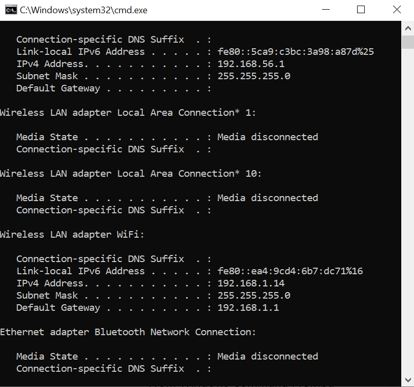
*Figure 4: Windows host-only adapter configuration using `ipconfig`.*

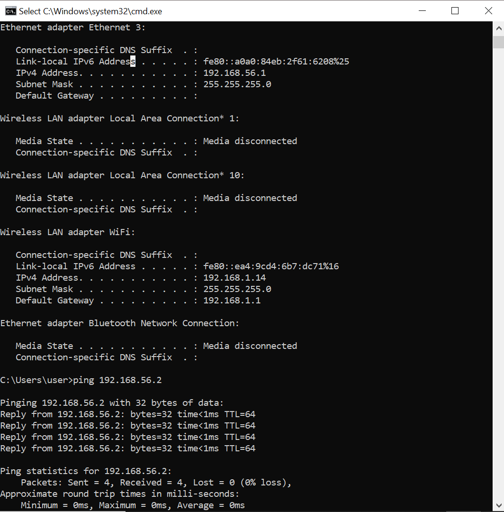
*Figure 5: Successful ping test confirming connectivity between host and OpenWRT VM.*

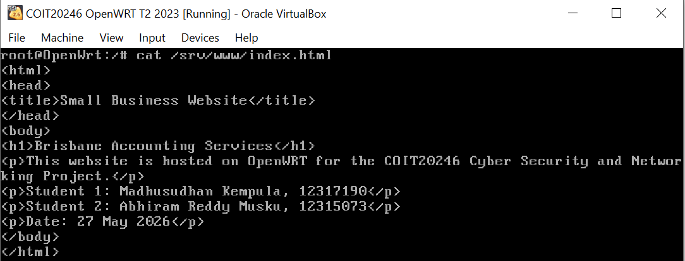
*Figure 6: HTML source code of the hosted website stored in `/srv/www/index.html`.*

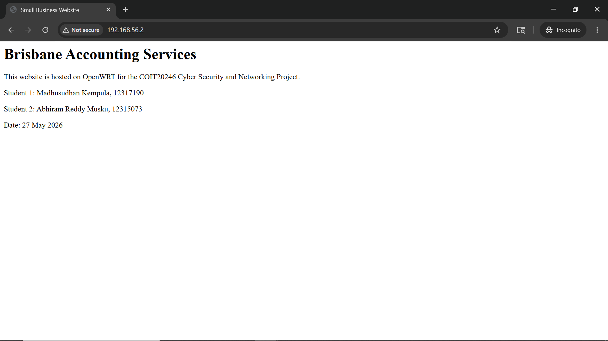
*Figure 7: Website successfully accessed through the browser.*

*Figure 8: Lab network topology showing VirtualBox, OpenWRT, and host-only network connections.*

[View lab network draw.io file](./Lab%20Network%20Diagram.drawio)

## Firewall Configuration

Firewall rules were tested with before-and-after evidence. HTTP port 80 was allowed, then blocked using `Block_HTTP_Test`, making the website inaccessible. The rule was then changed back to `ACCEPT`. SSH was changed from port 22 to 2222, ICMP was blocked and re-enabled, and management access on port 81 was restricted while port 80 remained accessible.

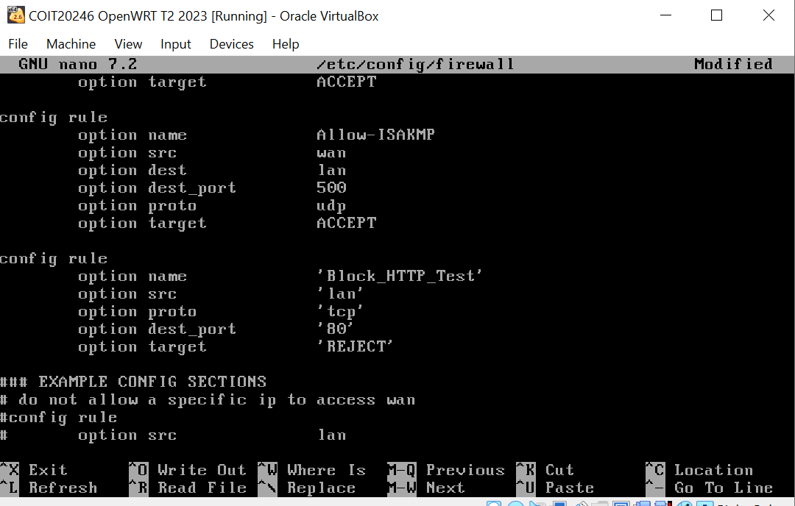
*Figure 9: Firewall rule configuration used to block HTTP traffic on port 80.*

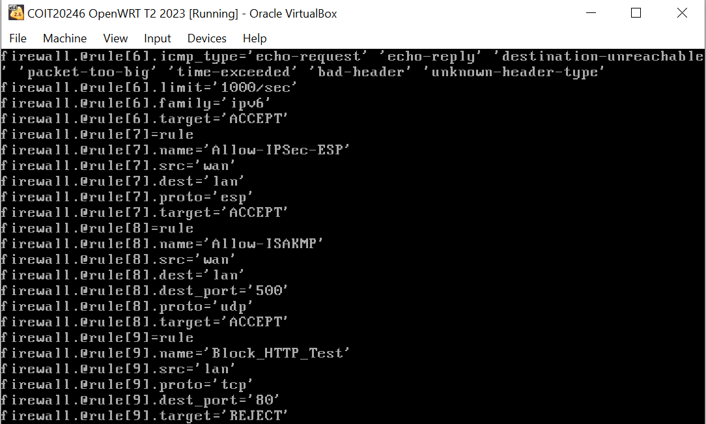
*Figure 10: UCI firewall configuration showing the HTTP blocking rule.*

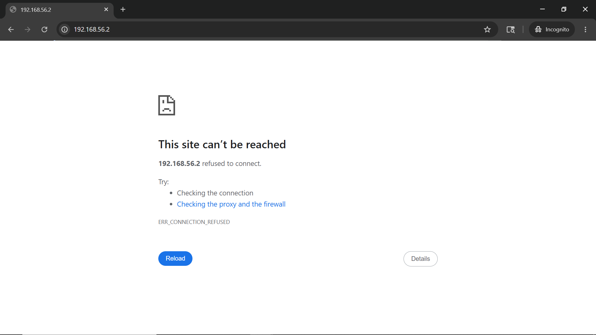
*Figure 11: Browser output showing HTTP access blocked by firewall rules.*

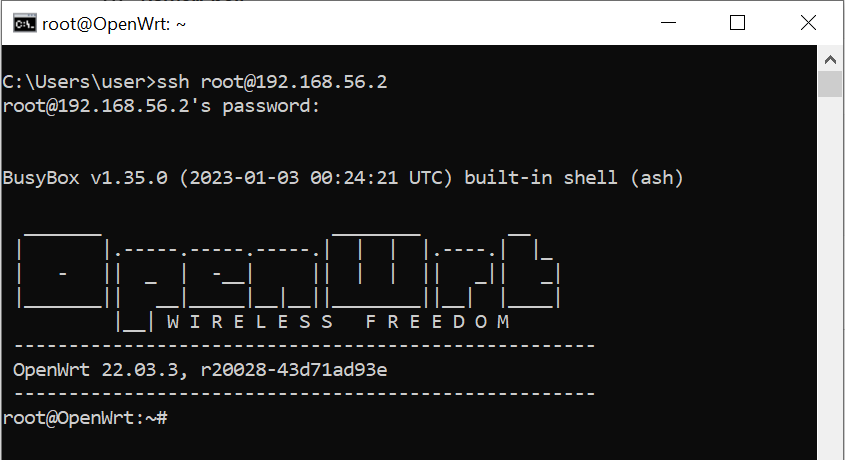
*Figure 12: Successful SSH connection using the default port 22 before modification.*

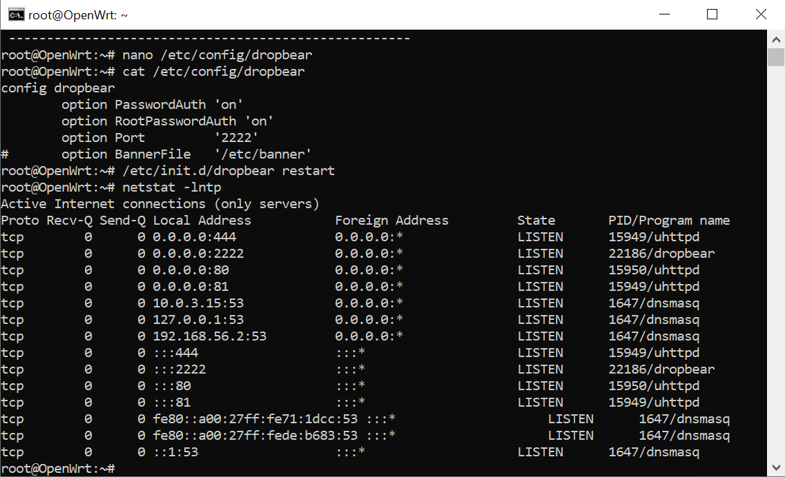
*Figure 13: Dropbear SSH service configuration changed from port 22 to port 2222.*

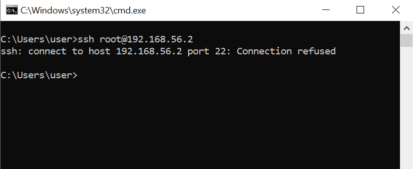
*Figure 14: SSH connection attempt on port 22 refused after port modification.*

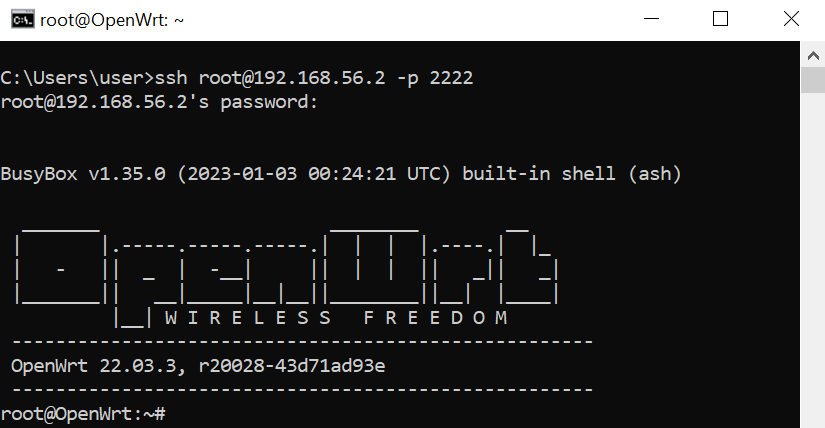
*Figure 15: Successful SSH connection established using port 2222.*

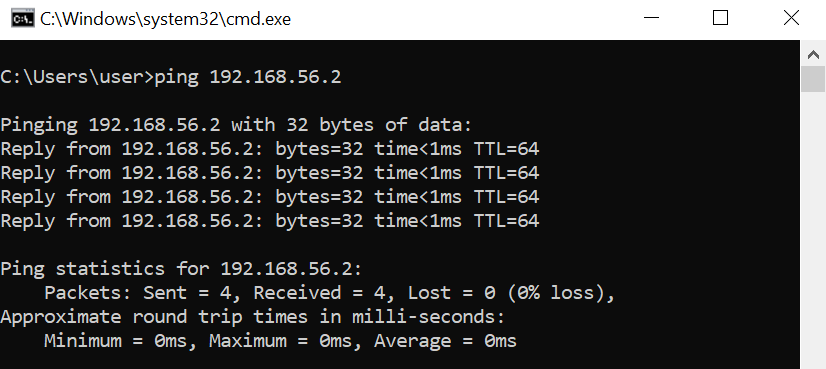
*Figure 16: Successful ICMP ping test before firewall restrictions were applied.*

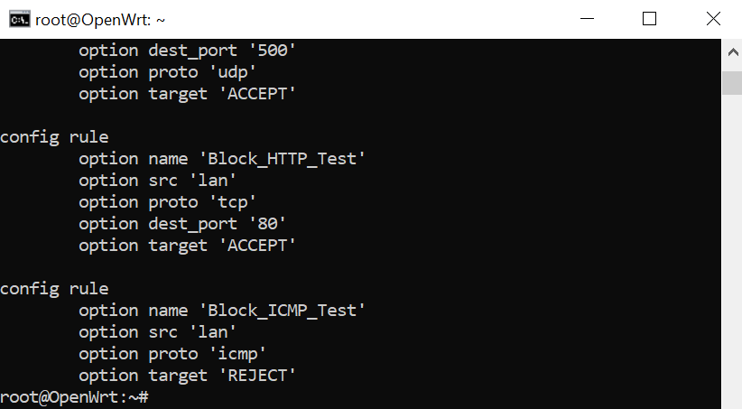
*Figure 17: Firewall rule configuration used to block ICMP traffic.*

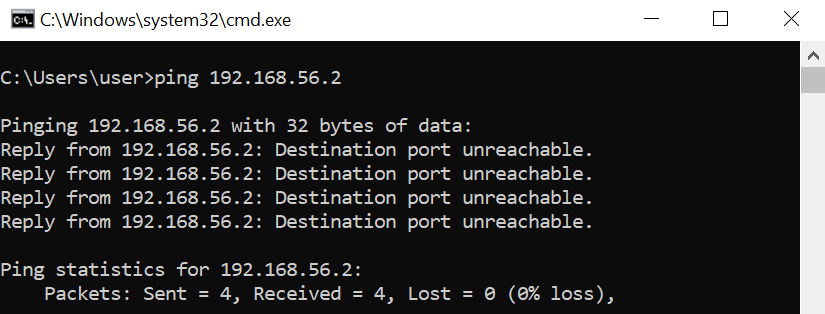
*Figure 18: Failed ICMP ping response after ICMP traffic was blocked.*

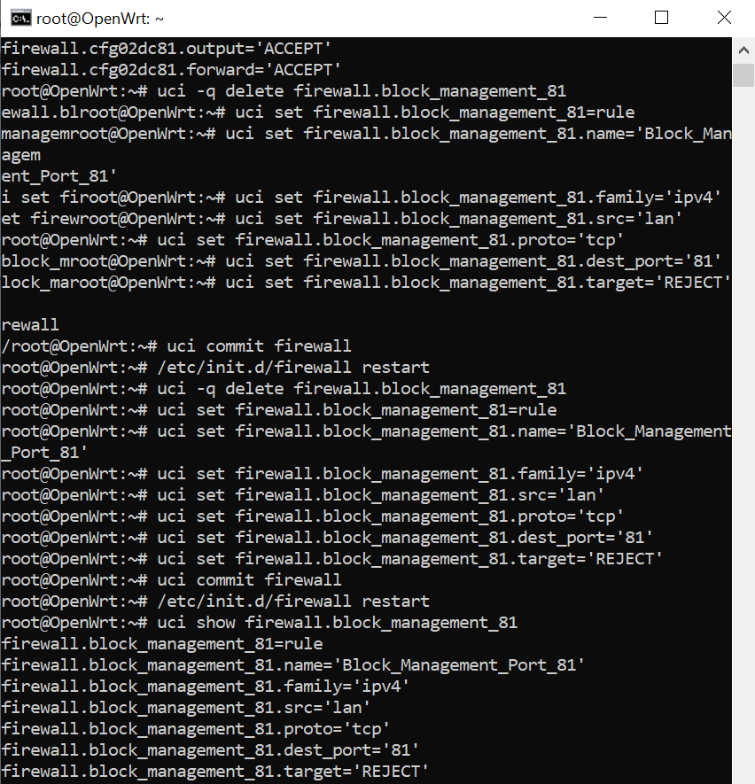
*Figure 19: Firewall rule restricting management access on port 81.*

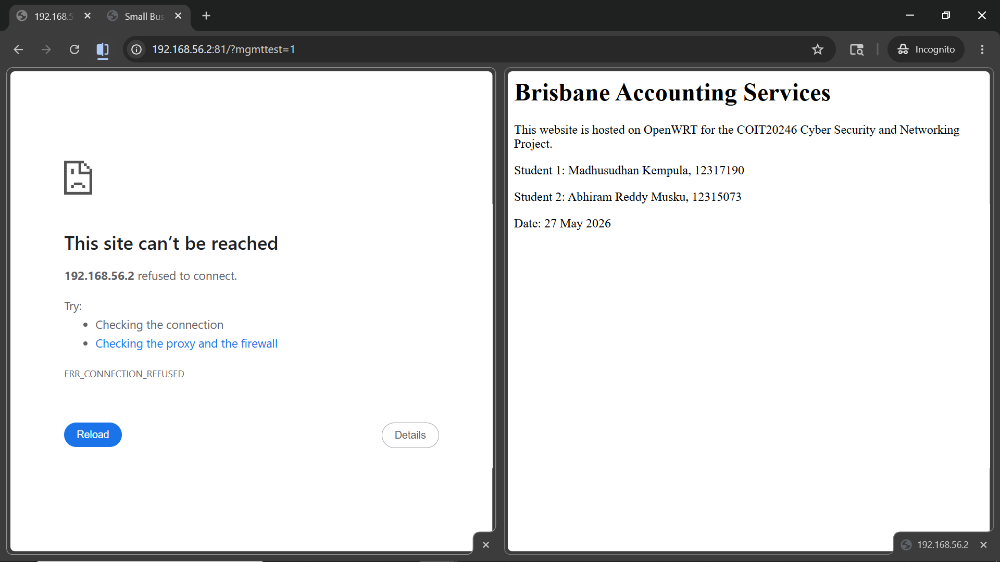
*Figure 20: Port 81 access blocked while web access on port 80 remained operational.*

## Production Network Design

The production design includes an OpenWRT router/firewall, staff LAN, DMZ web server, management network, and internet connection. The production IP scheme uses `90.x.x.x` addresses based on student ID `12317190`.

*Figure 21: Proposed production network topology including LAN, DMZ, management network, and internet connection.*

[View production network draw.io file](./Production%20Network%20Diagram.drawio)
